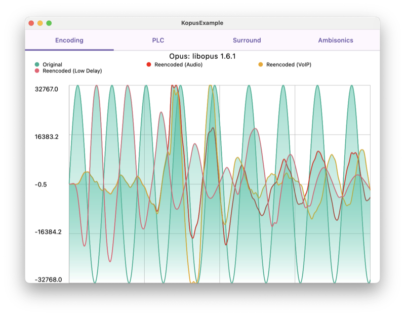
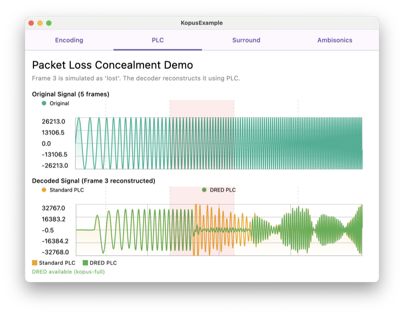
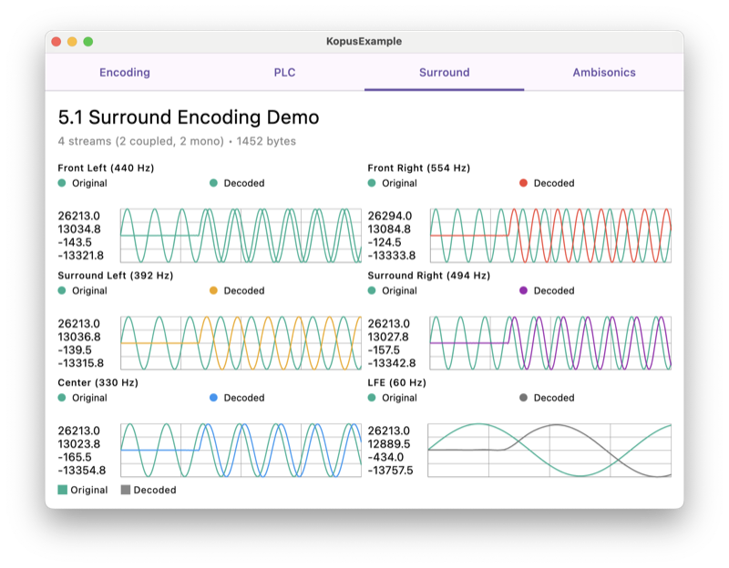
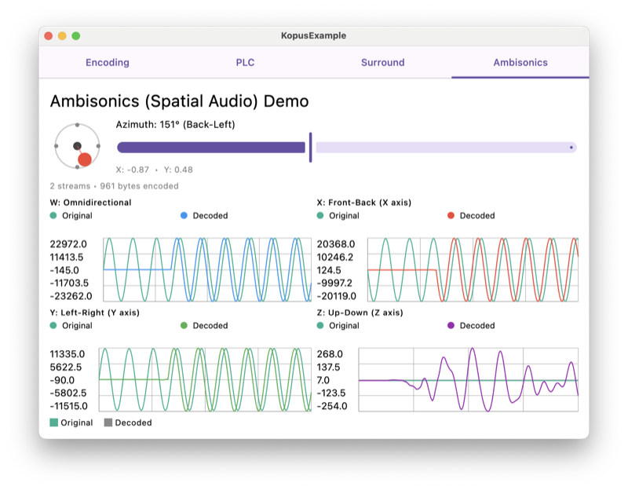

# Kopus

Kopus is a lightweight Kotlin Multiplatform wrapper for the [Opus audio codec](https://opus-codec.org/). It provides Kotlin bindings for Opus encoding and decoding functionality across Android, JVM, and iOS platforms.



## Features

- **Thin wrapper** over the native Opus C API
- **Kotlin Multiplatform** support for Android, JVM, and iOS
- **Complete API access** to all Opus encoder and decoder settings
- **Optimized native libraries** for various architectures
- **Multi-channel audio** with multistream encoder/decoder for surround sound (5.1, 7.1)
- **Spatial audio** with projection encoder/decoder for ambisonics
- **Packet loss handling** with PLC and DRED support (kopus-full)

## Supported Platforms

- **Android**: arm64-v8a, armeabi-v7a, x86_64
- **iOS**: arm64 (device), x86_64/arm64 (simulator)
- **macOS**: arm64, x86_64
- **Linux**: x86_64, arm64
- **Windows**: x86_64

## Installation

### Gradle

```kotlin
dependencies {
    // Standard version
    implementation("eu.buney.kopus:kopus:1.6.1.1")

    // Full version with DRED/OSCE/QEXT (larger binary size)
    implementation("eu.buney.kopus:kopus-full:1.6.1.1")
}
```

> **Note**: Kopus version numbers align with the underlying Opus library versions (with an added patch number) to maintain transparency and make it clear which version of the Opus codec is being used.

## Basic Usage

### Encoding Audio

```kotlin
// Create an encoder (defaults to VOIP application mode)
val encoder = OpusEncoder(
    sampleRate = 48000,  // Sample rate in Hz (8000, 12000, 16000, 24000, or 48000)
    channels = 1,        // 1 for mono, 2 for stereo
    application = OpusApplication.Voip  // Voip, Audio, or RestrictedLowDelay
)

// Configure encoder settings if needed
encoder.setBitrate(32000)  // 32 kbps
encoder.setComplexity(10)  // Maximum quality
encoder.setVBR(1)          // Enable variable bitrate

// Encode audio data
val pcmInput = shortArrayOf(/* your PCM audio samples */)
val encodedBytes = encoder.encode(pcmInput)

// Clean up when done
encoder.close()
```

### Decoding Audio

```kotlin
// Create a decoder
val decoder = OpusDecoder(
    sampleRate = 48000,  // Must match encoder sample rate
    channels = 1         // Must match encoder channels
)

// Decode a packet
val encodedData = byteArrayOf(/* your Opus packet */)
val frameSize = 960  // 20ms at 48kHz
val pcmOutput = decoder.decode(encodedData, frameSize)

// Clean up when done
decoder.close()
```

## Packet Loss Concealment (PLC)

Handle missing packets gracefully. When a packet is lost, pass `null` to the decoder to generate concealment audio. With `kopus-full`, DRED provides neural network-based recovery for even better quality.

```kotlin
val decoder = OpusDecoder(sampleRate = 48000, channels = 1)

// Normal decode
val audio = decoder.decode(packet, frameSize = 960)

// Packet lost - generate concealment
val concealed = decoder.decode(null, frameSize = 960)
```



## Surround Sound (5.1, 7.1)

Encode and decode multi-channel audio using the multistream API. Supports standard channel layouts like 5.1 and 7.1 surround.

```kotlin
// 5.1 surround: 6 channels
val encoder = OpusMultistreamEncoder(
    sampleRate = 48000,
    channels = 6,
    streams = 4,
    coupledStreams = 2,
    mapping = byteArrayOf(0, 4, 1, 2, 3, 5)
)
val encoded = encoder.encode(surroundPcm)
encoder.close()
```



## Ambisonics (Spatial Audio)

Encode spatial audio using ambisonics with the projection API. The encoder automatically handles the channel mapping for first-order ambisonics (4 channels).

```kotlin
// First-order ambisonics: 4 channels (W, Y, Z, X)
val encoder = OpusProjectionEncoder(
    sampleRate = 48000,
    channels = 4,
    streams = 2,
    coupledStreams = 2
)
val encoded = encoder.encode(ambisonicsPcm)
encoder.close()
```



## Advanced Usage

### Direct Control with ctl/ctlQuery

You can directly control encoder and decoder settings using the `ctl` and `ctlQuery` methods:

```kotlin
// Set bitrate directly using ctl
encoder.ctl(OPUS_SET_BITRATE_REQUEST, 32000)

// Get current bitrate using ctlQuery
val currentBitrate = encoder.ctlQuery(OPUS_GET_BITRATE_REQUEST)
println("Current bitrate: $currentBitrate bps")
```

### Extension Functions

Kopus includes convenient extension functions for all Opus control parameters:

```kotlin
// Encoder controls
encoder.setBitrate(32000)           // Set bitrate to 32 kbps
encoder.setSignal(OPUS_SIGNAL_MUSIC)
encoder.setInbandFEC(1)             // Enable Forward Error Correction
encoder.setPacketLossPerc(10)       // Expect 10% packet loss

// Decoder controls
decoder.setGain(10 * 256)           // 10 dB gain
```

> **Note**: Some extension functions haven't been extensively tested. While they should work correctly as they directly mirror the C API, they should be used with caution and tested in your specific application.

## ProGuard Configuration

### Android

For Android applications, ProGuard rules are automatically included with the library.

### JVM

If you're using ProGuard with JVM applications that include Kopus, add the following rules to your ProGuard configuration:

```
# Ensure native method calls remain intact
-keepclasseswithmembernames,includedescriptorclasses class * {
    native <methods>;
}

# Keep core JNI implementation classes
-keep class eu.buney.kopus.OpusEncoder
-keep class eu.buney.kopus.OpusDecoder
-keep class eu.buney.kopus.Opus
```

## Building from Source

Kopus uses different build approaches for each supported platform:

### iOS
iOS bindings use Kotlin/Native's cinterop to directly interface with Opus. Build the native Opus libraries for iOS:
```bash
./scripts/build_opus_apple.sh
```

### Android
Android bindings use JNI. Build the native Opus libraries for Android architectures:
```bash
./scripts/build_opus_android.sh
```

### Desktop Platforms
Desktop builds are more complex as they require libraries for multiple operating systems:

- **macOS**: Build the Opus library and JNI bindings for macOS:
  ```bash
  ./scripts/build_opus_apple.sh   # Builds the Opus library
  ./scripts/build_opus_jni.sh     # Builds the JNI bindings
  ```

- **Linux/Windows**: These platforms use Docker to ensure consistent builds:
  ```bash
  cd kopus/
  docker build -o ./build/jni_docker .
  ```

This produces native libraries that are packaged into the JVM artifacts, ensuring cross-platform compatibility.

### Building kopus-full

To build the full variant with DRED/OSCE/QEXT support:
```bash
./scripts/build_opus_apple.sh --full
./gradlew build -Pkopus.full=true
```

## License

Kopus is released under the MIT License. See [LICENSE](LICENSE) for details.
